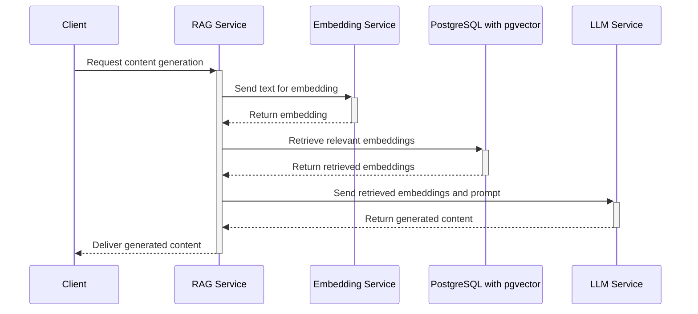
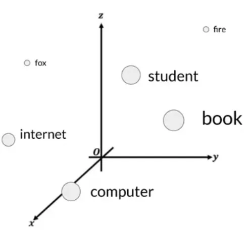
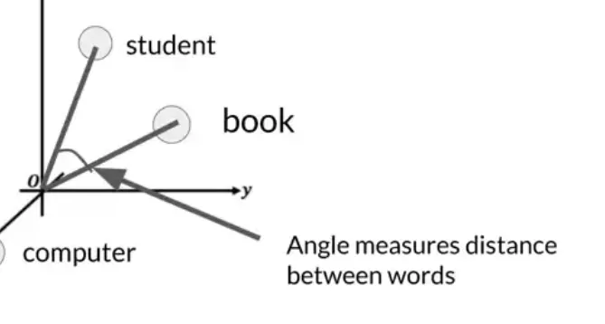

# Retrieval-Augmented Generation (RAG)
## Introduction (Written by ChatGPT)
Retrieval-Augmented Generation (RAG) is a technique that combines the capabilities of a language model, like GPT, with an external knowledge retrieval system to enhance the model's ability to generate responses that are informed by a broader context than the model's internal knowledge. This approach uses a two-step process: first, when a query is received, relevant information is retrieved from a database or a document collection, and second, this information is fed into a language model to generate a response that is contextual and informed by the retrieved data.
Benefits of RAG over a standalone Language Model like ChatGPT:

1. Enhanced Accuracy and Relevance: RAG can pull in the most relevant and recent information from external sources, ensuring that the responses are not only contextually appropriate but also up-to-date. This is particularly useful for topics that are dynamic and rapidly changing.
2. Reduced Model Bias: By relying on external data sources for generating responses, RAG can potentially reduce biases that are inherent in the training data of the standalone models. The breadth of information it can access helps in providing a balanced view.
3. Scalability and Flexibility: RAG allows for scaling the knowledge of the language model without needing to retrain the model extensively. It can adapt to new information or changes in knowledge by simply updating the external sources it retrieves data from.
4. Efficiency in Learning: Instead of retraining the language model to learn new facts or correct errors, updates can be made to the retrieval database, which is generally less resource-intensive compared to training large language models.
5. Customization: The external knowledge base can be customized and curated to fit specific use cases or domains, providing more tailored responses that are not possible with a generalist model like ChatGPT.

Overall, RAG provides a powerful way to enhance the capabilities of traditional language models by integrating them with dynamic, external knowledge sources, leading to more accurate, reliable, and relevant outputs.

## RAG Service Overview

## RAG Project
### Overview
We are going to work incrementally to cover the following: 

- Embeddings - How to turn text into a numerical representation (vector).
- Vector Store - A place to keep your embeddings! 
   - How to store embeddings
   - How to search for similar embeddings
- LLM Chat - How to access a chat service
- Prompt Engineering - How to incorporate retrieved data into a prompt and generate a response.


## Embeddings 
An embedding is a representation of complex data in a lower-dimensional space (vector), typically used to transform high-dimensional data (like text, images, or audio) into a format that can be efficiently processed and analyzed by machine learning models. Embeddings capture the essential characteristics or features of the data and represent them as vectors (arrays of numbers) in a way that preserves some aspect of the original data's relationships or structure.

*The following is stolen from https://medium.com/data-at-the-core/how-llms-work-explained-in-9-steps-transformer-acrhitecture-f35d06d1ee72*


If you imagine a vector size of just three, you could plot the words into a three-dimensional space and see the relationships between those words : 



You can see now how you can relate words that are located close to each other in the embedding space, and how you can calculate the distance between the words as an angle, which gives the model the ability to mathematically understand language.


Why Use Embeddings for Retrieval?

Embeddings are particularly useful for retrieval tasks due to several reasons:

1. Semantic Similarity: Embeddings are designed to map semantically similar items close to each other in the embedding space. For instance, text embeddings ensure that phrases or documents with similar meanings are located near each other. This property is invaluable for retrieval systems as it allows for finding items that are similar in content or meaning, not just in exact matching terms.
2. Efficiency: High-dimensional data like text or images are computationally expensive and complex to compare directly. By converting them into a dense, lower-dimensional space, embeddings significantly reduce the computational load. This makes searching and retrieval operations faster and more scalable, even with very large datasets.
3. Flexibility: Embeddings can be derived from different models tailored for specific kinds of data (e.g., Word2Vec or BERT for text, ResNet for images). This flexibility allows embeddings to be used across various domains and types of content, optimizing performance for specific retrieval needs.
4. Handling Unstructured Data: Much of the data available today is unstructured (e.g., text, images, video). Embeddings provide a way to structure this data into a quantifiable format that machine learning algorithms can process, making them particularly useful for tasks involving natural language processing or computer vision.
5. Improving Search Results: In applications like search engines, recommendation systems, or information retrieval, using embeddings can improve the relevance of the search results. The system can understand the context or deeper meaning of the query and return results that are more pertinent to the user's intent, not just keyword-based matches.

In summary, embeddings are a cornerstone technology for modern retrieval systems, enabling them to operate efficiently, handle complex and high-dimensional data, and deliver more accurate, contextually relevant results based on semantic similarity. This makes them indispensable in fields like search technology, recommendation systems, and more broadly in AI applications dealing with large and diverse datasets.

## Project
### Introduction
#### What is RAG?
We are going to build a simple RAG Service that takes input as text, retrieves related data and uses that to augment a generative response.
1. Check out the project
2. Set up a local vector database
   1. Get the PGVector Postgres docker image `docker pull ankane/pgvector:latest`
   2. Create a new container `docker run --name rag_postgres -e POSTGRES_PASSWORD=123umd -e POSTGRES_USER=postgres -p 5432:5432 -v ragpgdata:/var/lib/postgresql/data -d ankane/pgvector`
   3. Test connection to localhost:5432 in your DB IDE
   4. Run the following SQL to install PGVector and set up Spring AI table
   ```postgresql
   CREATE EXTENSION IF NOT EXISTS vector;
   CREATE EXTENSION IF NOT EXISTS hstore;
   CREATE EXTENSION IF NOT EXISTS "uuid-ossp";
   
   CREATE TABLE IF NOT EXISTS vector_store (
       id uuid DEFAULT uuid_generate_v4() PRIMARY KEY,
       content text,
       metadata json,
       embedding vector(1536)
   );
   
   CREATE INDEX ON vector_store USING HNSW (embedding vector_cosine_ops);
   ```
3. 
#### Project Overview
#### Prerequisites
This Workshop has a lot of required software before we can get started. Please have these installed and configured prior to the workshop.

## Software Checklist
- [X] [Git](https://git-scm.com/downloads) - Version Control Manager. (MacOS should already have it, Windows can be downloaded in the Microsoft Store)
- [X] [Node.js](https://nodejs.org/en/download/current) - Needed for UMD AWS Authentication tool
- [X] [UMD AWS Cli Authentication](https://umd-dit.atlassian.net/wiki/spaces/PS/pages/25790559/AWS+CLI+Authentication) - Needed to Authenticate to AWS so we can use their AI services
- [X] [Java 21](https://jdk.java.net/21/) - Latest java program. Make sure it is in the path so if you run `java -version` it says version 21.x
- [X] [Maven](https://maven.apache.org/download.cgi) - A build and dependency/package management system for Java (like pip/npm)
- [X] [Docker / Docker Desktop](https://www.docker.com/products/docker-desktop/) - Used to set up a local Postgres Database with PGVector installed.
- [X] An IDE for Java such as [IntelliJ](https://www.jetbrains.com/idea/download/)
- [X] A Database IDE such as [DataGrip](https://www.jetbrains.com/datagrip/download/), DbVisualizer, or Toad

Run each of these commands and make sure there are no errors in the output.
* `git --version`
* `node --version`
* `npm --version`
* `umd_aws_auth -V`
* `java -version` &rarr; Must be version 21+ (If not please install and set the PATH in your system)
* `mvn -version`
* `docker --version`