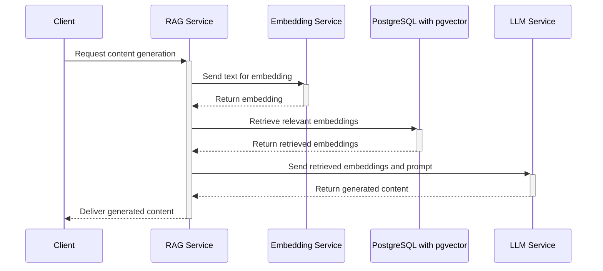
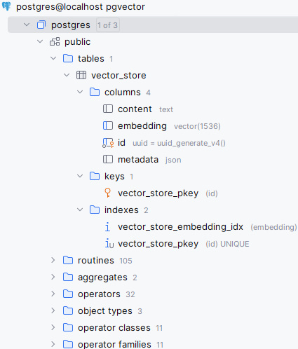
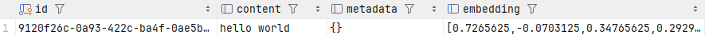

# Retrieval-Augmented Generation (RAG)
## Introduction (Written by ChatGPT)
Retrieval-Augmented Generation (RAG) is a technique that combines the capabilities of a language model, like GPT, with an external knowledge retrieval system to enhance the model's ability to generate responses that are informed by a broader context than the model's internal knowledge. This approach uses a two-step process: first, when a query is received, relevant information is retrieved from a database or a document collection, and second, this information is fed into a language model to generate a response that is contextual and informed by the retrieved data.
Benefits of RAG over a standalone Language Model like ChatGPT:

1. Enhanced Accuracy and Relevance: RAG can pull in the most relevant and recent information from external sources, ensuring that the responses are not only contextually appropriate but also up-to-date. This is particularly useful for topics that are dynamic and rapidly changing.
2. Reduced Model Bias: By relying on external data sources for generating responses, RAG can potentially reduce biases that are inherent in the training data of the standalone models. The breadth of information it can access helps in providing a balanced view.
3. Scalability and Flexibility: RAG allows for scaling the knowledge of the language model without needing to retrain the model extensively. It can adapt to new information or changes in knowledge by simply updating the external sources it retrieves data from.
4. Efficiency in Learning: Instead of retraining the language model to learn new facts or correct errors, updates can be made to the retrieval database, which is generally less resource-intensive compared to training large language models.
5. Customization: The external knowledge base can be customized and curated to fit specific use cases or domains, providing more tailored responses that are not possible with a generalist model like ChatGPT.

Overall, RAG provides a powerful way to enhance the capabilities of traditional language models by integrating them with dynamic, external knowledge sources, leading to more accurate, reliable, and relevant outputs.

## RAG Service Overview

## RAG Project
### Overview
We are going to work incrementally to cover the following: 

- Check out project
- Embeddings - How to turn text into a numerical representation (vector).
- Vector Store - A place to keep your embeddings! 
   - How to store embeddings
   - How to search for similar embeddings
- LLM Chat - How to access a chat service
- Prompt Engineering - How to incorporate retrieved data into a prompt and generate a response.

### Prerequisites
This Workshop has a lot of required software before we can get started. Please have these installed and configured prior to the workshop.

#### Software Checklist
- [X] [Git](https://git-scm.com/downloads) - Version Control Manager. (MacOS should already have it, Windows can be downloaded in the Microsoft Store)
- [X] [Node.js](https://nodejs.org/en/download/current) - Needed for UMD AWS Authentication tool
- [X] [UMD AWS Cli Authentication](https://umd-dit.atlassian.net/wiki/spaces/PS/pages/25790559/AWS+CLI+Authentication) - Needed to Authenticate to AWS so we can use their AI services
- [X] [Java 21](https://jdk.java.net/21/) - Latest java program. Make sure it is in the path so if you run `java -version` it says version 21.x
- [X] [Maven](https://maven.apache.org/download.cgi) - A build and dependency/package management system for Java (like pip/npm)
- [X] [Docker / Docker Desktop](https://www.docker.com/products/docker-desktop/) - Used to set up a local Postgres Database with PGVector installed.
- [X] An IDE for Java such as [IntelliJ](https://www.jetbrains.com/idea/download/)
- [X] A Database IDE such as [DataGrip](https://www.jetbrains.com/datagrip/download/), DbVisualizer, or Toad

Run each of these commands and make sure there are no errors in the output.
* `git --version`
* `node --version`
* `npm --version`
* `umd_aws_auth -V`
* `java -version` &rarr; Must be version 21+ (If not please install and set the PATH in your system)
* `mvn -version`
* `docker --version` &rarr; Make sure docker desktop is running if you are on Windows.

### Check out the project
1. Open up a command shell  
2. Clone the repo https://gitlab.umd.edu/depstei2/rag-spring-ai  
   Go to a directory where you want to download the project and run   
   `git clone -b skeleton https://gitlab.umd.edu/depstei2/rag-spring-ai.git`
3. Build the project: `mvn package`
4. Run the project: `java -jar .\target\rag-spring-ai-0.0.1-SNAPSHOT.jar`
5. At the prompt, enter `help` and then `exit`

### Embeddings
Embedding overview: [embeddings.md](embeddings.md)

Let's add a dependency for AWS Bedrock AI:  
**pom.xml**:  
```xml 
<dependency>
  <groupId>org.springframework.ai</groupId>
  <artifactId>spring-ai-bedrock-ai-spring-boot-starter</artifactId>
</dependency>
```
Configure the AWS environment, and the embedding client  
**./src/main/resources/application.properties**:
```properties
spring.ai.bedrock.aws.region=us-east-1
spring.ai.bedrock.titan.embedding.enabled=true
spring.ai.bedrock.titan.embedding.input-type=text
spring.ai.bedrock.titan.embedding.model=amazon.titan-embed-text-v1
```

In RAGService.java, add an EmbeddingClient and set up injection via the constructor. 
Then implement the `getEmbedding` method.   
**RAGService**:
```java
import org.springframework.ai.embedding.EmbeddingClient;

@Service
public class RAGService {
    ...
    private final EmbeddingClient embeddingClient;
    ...
    public RAGService(EmbeddingClient embeddingClient) {
        this.embeddingClient = embeddingClient;
    }
    
    public String getEmbedding(String text) {
        return embeddingClient.embed(text).toString();
    }
    ...
}
```
To connect to AWS Bedrock, we first need to log in. 
Log in (Check for DUO Push):  
```
umd_aws_auth -g innovation-lab-ragllm
```
Set your default Role (Replace with your login information):  
```
umd_aws_auth -u depstei2 -P innovation-lab-ragllm -a 259271463358 -f bedrock-innovation-lab-BedrockUsageRole-20fYsBdHS9FL -p "default"
```


Now we can rebuild the project and run the application again:
`mvn package`  
`java -jar .\target\rag-spring-ai-0.0.1-SNAPSHOT.jar`

At the `shell:>` command, enter `embed "hello world"`. Note the quotes, you need to double quote any text that contains spaces when using the spring shell. 

This should output:
`[0.7265625, -0.0703125, 0.34765625, 0.29296875, 0.9140625, 0.4921875, 0.5390625, ...]`  

**Congratulations!** You just turned text into a multidimensional vector.  

---  
### Vector Store
A vector store is a database or storage system that is optimized for handling vector data. 
These vector stores are particularly useful in areas such as similarity search, machine learning, and artificial intelligence, where efficient storage, indexing, and retrieval of high-dimensional vectors are crucial.

For our vector store, we are going to use [PostgresDB](https://www.postgresql.org/) database with the [PG Vector Plugin](https://github.com/pgvector/pgvector) that allows for efficient storage and retrieval of vector data.

Dust off your docker! We will use it to quickly set up the database.
1. Make sure Docker Desktop is running.
2. Download the PGVector Postgres docker image `docker pull ankane/pgvector:latest`
3. Create a new container `docker run --name rag_postgres -e POSTGRES_PASSWORD=123umd -e POSTGRES_USER=postgres -p 5432:5432 -v ragpgdata:/var/lib/postgresql/data -d ankane/pgvector`
4. Test connection to localhost:5432 in your DB IDE with the user `postgres` and password `123umd`

We now have a vector store to put our embeddings in!

Let's set it up in the project.

First we need all the postgres dependencies:
**pom.xml**:
```xml 
<dependency>
  <groupId>org.springframework.ai</groupId>
  <artifactId>spring-ai-pgvector-store-spring-boot-starter</artifactId>
</dependency>
```

Add these properties to connect to our local database and configure our vector store   
**./src/main/resources/application.properties**:
```properties
spring.datasource.url=jdbc:postgresql://localhost:5432/postgres
spring.datasource.username=postgres
spring.datasource.password=123umd

spring.ai.vectorstore.pgvector.dimensions=1536
```

Now we will inject a VectorStore into our service and implement a basic load function:  
**RAGService.java**  
```java
import org.springframework.ai.vectorstore.VectorStore;
...
@Service
public class RAGService {
    ...
    private final VectorStore vectorStore;
    ...
    public RAGService(EmbeddingClient embeddingClient, VectorStore vectorStore) {
        this.embeddingClient = embeddingClient;
        this.vectorStore = vectorStore;
    }
    ...
    public String loadData(String data) {
        Document document = new Document(data);
        vectorStore.add(List.of(document));
        return "Loaded " + data;
    }
    ...
}
```
We can rebuild the project and run the application again:  
`mvn package`  
`java -jar .\target\rag-spring-ai-0.0.1-SNAPSHOT.jar`

Let's check out the database again. Spring AI has enabled the PGVector plugin and also created a `vector_store` table to store our embeddings.  
  

Let's load some data!
At the `shell:>` command, enter `load "hello world"`  
refresh your database view of `vector_store` and you will now see the embedding has been inserted:
  

### Loading PDF Data
Let's load some data from PDFs using a Spring PDF Parser.

Grab the spring pdf parser dependencies:  
**pom.xml**:
```xml 
<dependency>
  <groupId>org.springframework.ai</groupId>
  <artifactId>spring-ai-pdf-document-reader</artifactId>
  <version>0.8.1</version>
</dependency>
```
Lets change the `loadData` to load pdf files.  
**RAGService.java**  
```java
...
import org.springframework.ai.reader.pdf.PagePdfDocumentReader;
    ...
    public String loadData(String fileName) {
        DocumentReader pdfDocumentReader = new PagePdfDocumentReader(new ClassPathResource("data/"+fileName));
        List<Document> documents = pdfDocumentReader.get();
        vectorStore.add(documents);
        return "loaded " + fileName;
    }
...    
```
Notice the `Document` class. It is a Spring AI object that stores metadata, embeddings, and document content.
The `vectorStore.add()` is doing a lot of work for us. It is getting the embedding from our embedding service, and then storing it to our vector store all in one call.

Let's load some PDFs!
Build and run the program and type:
`load risk.pdf`  

Check out your Postgres - notice the metadata!
Load some more game manual PDFs in the `src/main/resources/data` folder

### Similarity Search
Now that we have some data, lets search it for related text.

**RAGService.java**  
```java
    ...
    public String search(String text) {
        List<Document> similarDocs = vectorStore.similaritySearch(text);
        return similarDocs.stream().map(Document::getFormattedContent).collect(Collectors.joining("\n"));
    }
    ...
```   
Rebuild and run the application. Do some searches using the `search` command e.g.  
`search "how many green apple cards do I need to win?"` 

### Chat API
Connecting to generative chat endpoints is easy with Spring Boot AI.

We need to turn on/configure the chat model we are going to use. Anthropic is a LLM model in [AWS Bedrock](https://aws.amazon.com/bedrock/)    
**./src/main/resources/application.properties**  
```properties
spring.ai.bedrock.anthropic.chat.enabled=true
```

Let's add the Anthropic chat service and inject it into our RAG Service:  
**RAGService.java**  
```java
...
import org.springframework.ai.chat.ChatClient;
...
@Service
public class RAGService {
    ...
    private final ChatClient chatClient;
    ...
    public RAGService(EmbeddingClient embeddingClient, VectorStore vectorStore, ChatClient chatClient) {
        this.embeddingClient = embeddingClient;
        this.vectorStore = vectorStore;
        this.chatClient = chatClient;
    }
    ...
    public String chat(String text) {
        return chatClient.call(text);
    }
    ...
}
```

You can now interact with the LLM chat with the `chat` command e.g. `chat "how many sides does a circle have?"`

### RAG - Putting it all together
We now have all the pieces, RAG assemble!

We need to implement the doRAG() method by getting a list of similar documents, feeding them into a prompt and then calling the chat endpoint.

**RAGService.java**  
```java
...
    public String doRAG(String input) {
        List<Document> similarDocuments = vectorStore.similaritySearch(input);
        Prompt prompt = generatePrompt(input, similarDocuments);
        logger.info("Prompt: \n" + prompt.getContents());
        return chatClient.call(prompt).getResult().getOutput().getContent();
    }

    private Prompt generatePrompt(String input, List<Document> similarDocuments) {
        PromptTemplate promptTemplate = new PromptTemplate("""
                Answer the question based on the context below. Keep the answer short and concise. Respond "Unsure about answer" if not sure about the answer.

                Context: {context}

                Question: {question}

                Answer:
                """);
        String context = similarDocuments.stream().map((Document::getContent))
                .collect(Collectors.joining("\n"));
        return promptTemplate.create(Map.of("context", context, "question", input));
    }
...
```
Notice the PromptTemplate. It is a Spring AI construct used to merge Document results with the original question.  

Try some RAG queries:  
`rag "how many cards do I need to win apples to apples when playing with 4 players?"`  

### Issues with Similarity
Try asking a question unrelated to board games:  
`rag "what dances did dinosaurse like to do?"`

Let's tweak the similarity search, so it only return results that are similar based on a threshold.

**RAGService.java**
```java
...
List<Document> similarDocuments = vectorStore.similaritySearch(SearchRequest.query(input)
        .withSimilarityThreshold(0.5));
...
```

Now if results are not close enough in our vector store, nothing is returned.

### Considerations
* Different models for LLM and Embeddings?
* How do we structure data in embeddings?
  * Windowing
  * Metadata
* How do we tweak the prompt to get the best results?
* Canned responses?

### Team Exercise
* Break into teams!
* Pick a dataset to work on, we have some data:
  * UMD Courses
  * Health Center
  * Bursar's Office
* Create a data loader load embeddings
* Tweaks 
  * similarity threshold 
  * prompts 
  * Format the response 
  * Use your imagination!
* Show off your RAG Service

### Prompt engineering


