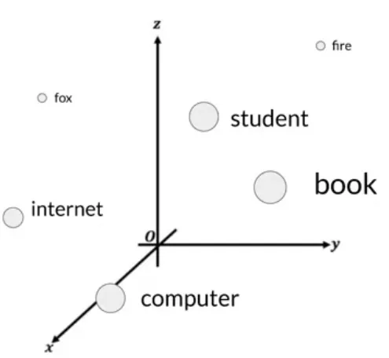

# Embeddings
An embedding is a representation of complex data in a lower-dimensional space (vector), typically used to transform high-dimensional data (like text, images, or audio) into a format that can be efficiently processed and analyzed by machine learning models. Embeddings capture the essential characteristics or features of the data and represent them as vectors (arrays of numbers) in a way that preserves some aspect of the original data's relationships or structure.

*The following is stolen from https://medium.com/data-at-the-core/how-llms-work-explained-in-9-steps-transformer-acrhitecture-f35d06d1ee72*

If you imagine a vector size of just three, you could plot the words into a three-dimensional space and see the relationships between those words:   
  
  
You can see now how you can relate words that are located close to each other in the embedding space, and how you can calculate the distance between the words as an angle, which gives the model the ability to mathematically understand language.    

## Why Use Embeddings for Retrieval?

Embeddings are particularly useful for retrieval tasks due to several reasons:

1. Semantic Similarity: Embeddings are designed to map semantically similar items close to each other in the embedding space. For instance, text embeddings ensure that phrases or documents with similar meanings are located near each other. This property is invaluable for retrieval systems as it allows for finding items that are similar in content or meaning, not just in exact matching terms.
2. Efficiency: High-dimensional data like text or images are computationally expensive and complex to compare directly. By converting them into a dense, lower-dimensional space, embeddings significantly reduce the computational load. This makes searching and retrieval operations faster and more scalable, even with very large datasets.
3. Flexibility: Embeddings can be derived from different models tailored for specific kinds of data (e.g., Word2Vec or BERT for text, ResNet for images). This flexibility allows embeddings to be used across various domains and types of content, optimizing performance for specific retrieval needs.
4. Handling Unstructured Data: Much of the data available today is unstructured (e.g., text, images, video). Embeddings provide a way to structure this data into a quantifiable format that machine learning algorithms can process, making them particularly useful for tasks involving natural language processing or computer vision.
5. Improving Search Results: In applications like search engines, recommendation systems, or information retrieval, using embeddings can improve the relevance of the search results. The system can understand the context or deeper meaning of the query and return results that are more pertinent to the user's intent, not just keyword-based matches.

In summary, embeddings are a cornerstone technology for modern retrieval systems, enabling them to operate efficiently, handle complex and high-dimensional data, and deliver more accurate, contextually relevant results based on semantic similarity. This makes them indispensable in fields like search technology, recommendation systems, and more broadly in AI applications dealing with large and diverse datasets.
